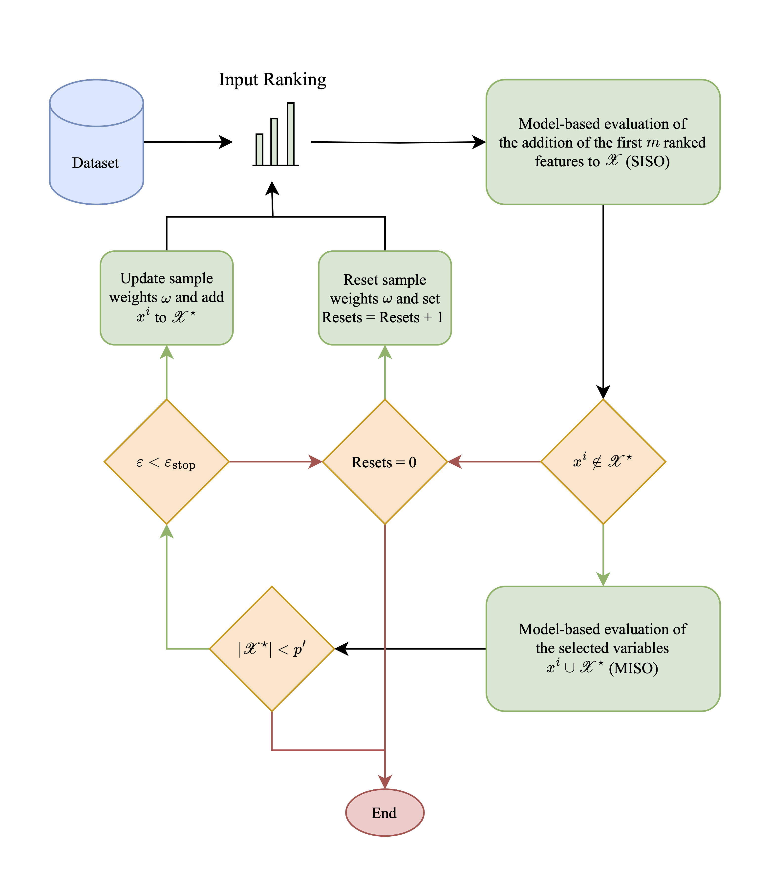

# FeatBoost-X
Python implementation of FeatBoost-X. See the [paper]() for details.


## Usage
```shell
pip install featboostx
```

### Example
```python
from featboostx import FeatBoostClassifier

clf = FeatBoostClassifier()
clf.fit(X, y)
print(clf.selected_subset_)
```
Please also check out the examples in `examples/`.


